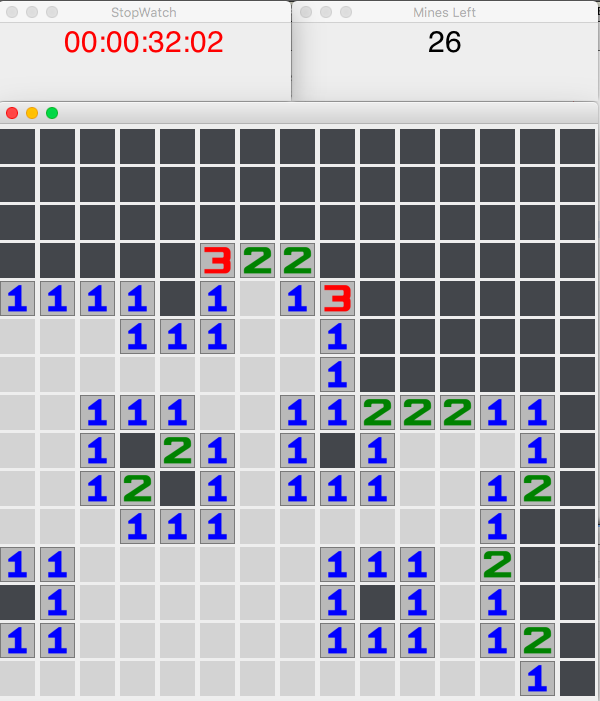

## June 2018: Java Graphic Implementation of Minesweeper. 
Utilizes OOP (Object-Oriented Programming) paradigm and JavaX Swing Graphics for a fully-functioning, customizable version of Minesweeper. 

## **Class Overview:**

### Tile

Tile is an all-purpose wrapper class for the JButtons in the Board that contains utility methods. It also contains one critical one, the method that determines the Board's action after a tile is clicked (mine explodes, number displayed, etc.) with floodfill algorithm. Most methods are self-explanatory, and documented in code. Important ones are listed below: 
- **resizeAndReturn(ImageIcon i):** Each tile begins with a default gray color, then changes to a number or a mine after being clicked. This method takes the native images and resizes them for a JButton (35x35 pixels). 
- **setObscured(Board b):** setObscured is run when a tile is clicked. It returns 0, 1, 2 if the user loses, neither wins nor loses, or the user wins. The algorithm is as follows: If tile is flagged, do nothing. If tile is mined, change tile icon and end game. If tile is numbered, change. If the tile is empty, it begins a floodfill to open all other empty compartments around it. 
- **setFlagged(Board b):** This handles flagging tiles. A return value of 0 indicates that a flag was set, a return value of 1 indicates a flag was unset. 2 shows game is won. 3 is default.
- **Tile(JButton j, boolean mined, int xC, int yC):** Constructor. Operates on a JButton initalized in the SweeperGame class. 

### Board
Initializes the game frame, displayed board, clickable buttons, button icons. The Board object carries several important methods that are utilized during gameplay, including:
- **public Board(int row, int col):** Constructor that initializes everything (sets difficulty, starts window, determines mines, etc.)
- **getCols():** Returns # of columns
- **getRows():** Returns # of rows
- **getGrid():** Returns array (Tile[][]) of buttons
- **isOutOfBounds(int x, int y):** Returns t/f if position is out of bounds
- **getNumOfMines():** Returns num of mines remaining (utilized in # of mines remaining side window)
- **isMine(double percentage):** During initialization of board, each tile has a random chance of spawning a mine based on the difficulty selected. That chance is the percentage passed into this method, which determines it.
- **IndexObscured(int r, int c):** Obscures a Tile object in the Board's buttons (Tile[][]) array with the getObscured() method
- **tilesAround(Tile t):** Finds number of tiles around a tile that are not out of bounds (considers corners separately)
- **minesAround(Tile t):** Finds num of mines around a tile
- **difficultySelect():** Opens a JOptionPane to allow users to select difficulty 
- **revealAll(MinesLeft m):** Reveals entire board if user hits mine (and game ends)
- **isGameWon():** Determines if game is over
- **initializeMines():** Sets initial values for mines
- **setIcons():** Sets unclicked icon pics
- **printBoardNums():** For debugging purposes only: Prints board and other information to console 

### SweeperGame
Sets up the game playing environment. Allows users to select difficulty, configures all buttons, and sets up separate panes with a stopwatch, # of mines left, and the board itself. 

